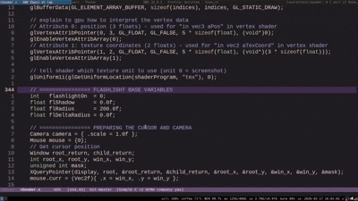

# CBoomer



A C port of [Boomer](https://github.com/tsoding/boomer) by Tsoding - an X11 zoomer application for Linux. This port focuses on the core functionality (screenshot viewing, zoom, pan, flashlight) and does not yet implement live window tracking (honestly, I've never used it)

## Features

- Fullscreen screenshot viewer with smooth zoom and pan
- Flashlight effect that follows your cursor
- Configurable controls and behavior
- Clean, modular C code with single-header libraries

## Pre-built Binaries

Check the [Releases](https://github.com/laserattack/cboomer/releases/) page for portable Linux executables:

- Single-file executable - just download, make executable, and run
- Includes all required libraries (X11, OpenGL, GLEW) - no dependencies to install
- Only requires:
  - Linux x86_64 system
  - X11 (Wayland not supported)
  - GPU with OpenGL support (any modern GPU works)

## Build from source

### Dependencies

- X11 development libraries (libX11, libXext, libXrandr)
- OpenGL development libraries (libGL, libGLX)
- GLEW (OpenGL Extension Wrangler)

### Build and run

```
make
./cboomer
```

For faster screenshot capture with MIT-SHM:

```
make USE_XSHM=1
./cboomer
```

## Default Controls

| Control                         | Action                   |
|---------------------------------|--------------------------|
| <kbd>Esc</kbd>                  | Quit                     |
| <kbd>1</kbd>                    | Reset camera             |
| <kbd>2</kbd>                    | Toggle flashlight        |
| <kbd>=</kbd>                    | Zoom in                  |
| <kbd>-</kbd>                    | Zoom out                 |
| Drag with left mouse            | Pan the image            |
| Scroll wheel                    | Zoom in/out              |
| <kbd>Ctrl</kbd> + Scroll wheel  | Change flashlight radius |

You can modify the controls in `config.h` and recompile

## Project Structure

- cboomer.c - Main application logic
- config.h - Configuration
- la.h - Linear algebra
- screenshot.h - Screenshot capture